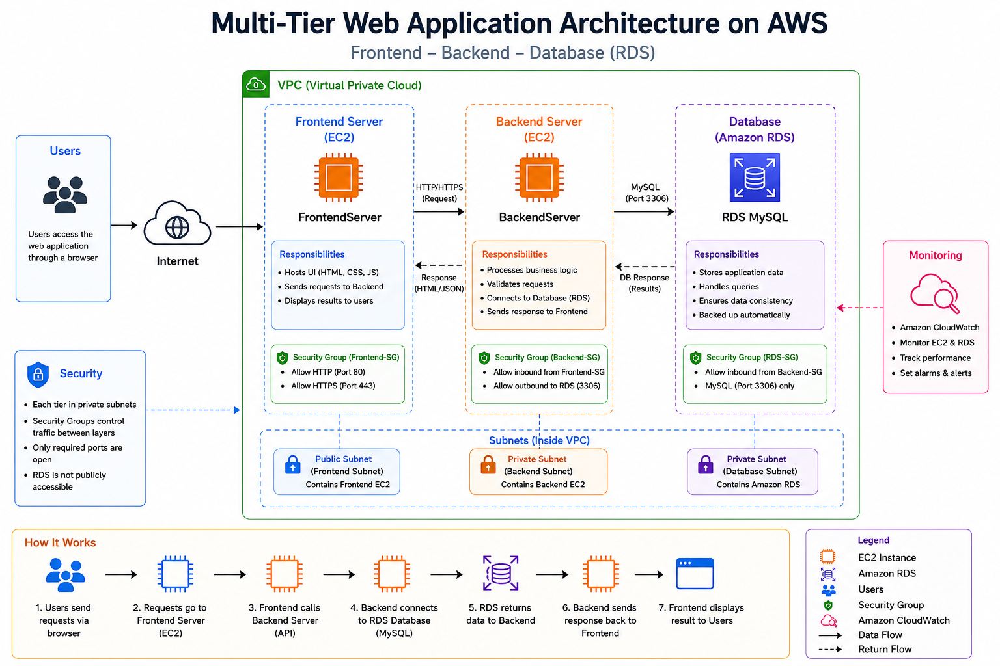
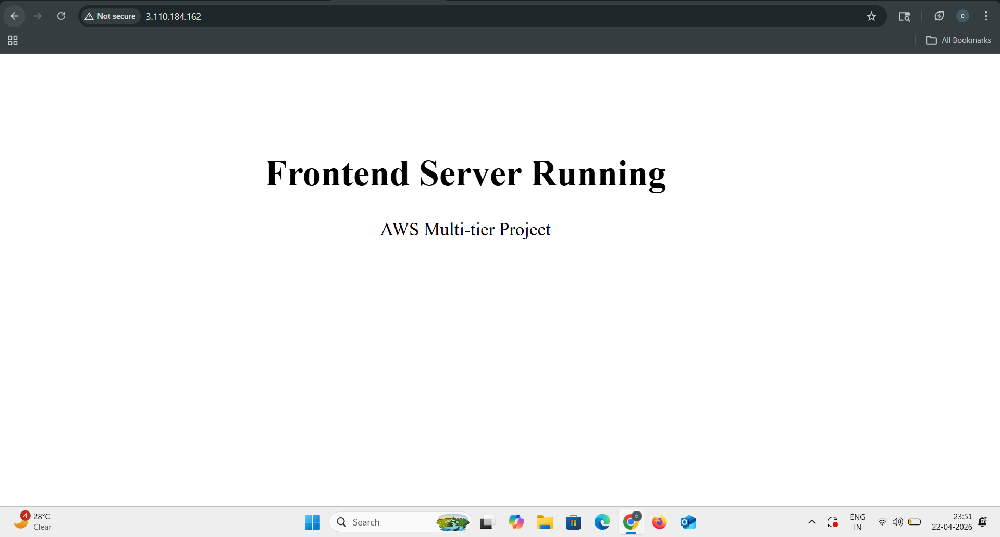
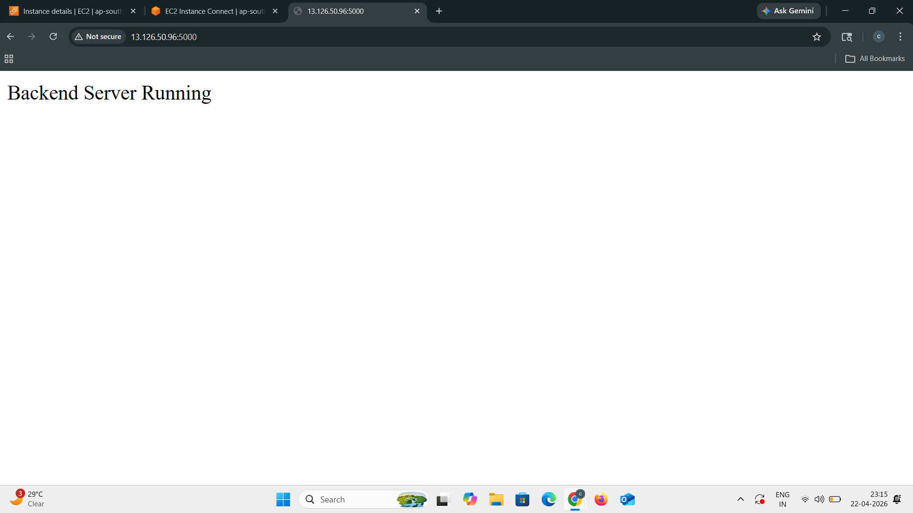
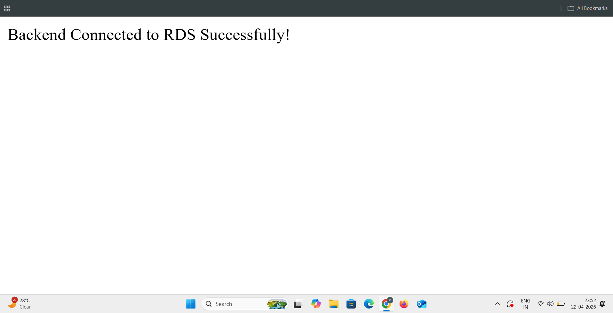
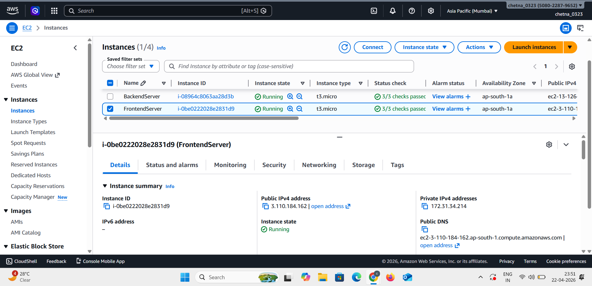
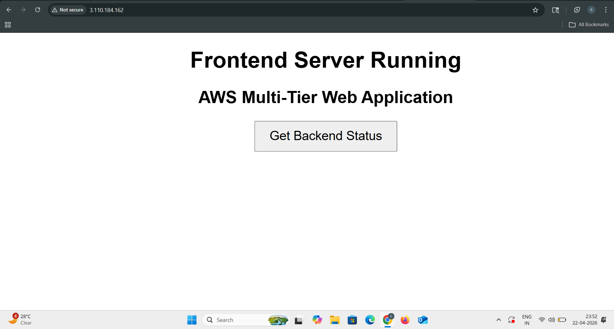

🚀 Multi-Tier Web Application Deployment on AWS


---

📌 Project Overview

This project demonstrates a **Multi-Tier Web Application Architecture** on AWS by separating the application into three layers:

* **Frontend (Web Server)**
* **Backend (Application Server)**
* **Database (Amazon RDS)**

Each layer runs independently, improving **scalability, security, and maintainability**.

---

🎯 Purpose

* Separate application layers (Frontend, Backend, Database)
* Improve security using layered architecture
* Enable independent scaling
* Follow real-world production architecture

---

🧰 AWS Services Used

* Amazon EC2 (Frontend + Backend Servers)
* Amazon RDS (Database)
* Load Balancer (Optional for scaling)
* Security Groups

---

🏗️ Architecture Diagram



**Flow:**

User → Frontend Server → Backend Server → RDS Database

---

🌐 Frontend Server



The frontend server:

* Hosts UI (HTML page)
* Sends requests to backend
* Displays application output

---

⚙️ Backend Server



The backend server:

* Processes requests from frontend
* Connects to RDS database
* Returns response to frontend

---

🗄️ Database (Amazon RDS)



RDS stores application data securely and allows backend to perform database operations.

---

🖥️ EC2 Instances



Two EC2 instances are used:

* Frontend Server
* Backend Server

---

🌐 Application Output



This confirms:

* Frontend is working
* Backend is reachable
* Backend successfully connected to RDS

---

🔥 Key Features

* Multi-tier architecture
* Separation of concerns
* Secure database connectivity
* Scalable design
* Real-world cloud architecture

---

📁 Project Structure

```id="d3x91k"
Multi-Tier-Web-App/
│── frontend/
│    └── index.html
│── backend/
│    └── app.py
│── README.md
│── screenshots/
│    ├── frontend.png
│    ├── backend.png
│    ├── backend-rds.png
│    ├── ec2.png
│    ├── output.png
│    ├── architecture.png
```

---

🧠 How It Works

1. User accesses frontend server
2. Frontend sends request to backend API
3. Backend processes request
4. Backend connects to RDS database
5. Data is fetched/stored
6. Response sent back to frontend

---

🔐 Security Design

* Frontend allows public access (HTTP/HTTPS)
* Backend only allows traffic from frontend
* RDS only accessible from backend
* Security Groups control all access

---


✅ Conclusion

This project demonstrates how to build a **production-ready multi-tier architecture** using AWS by separating frontend, backend, and database layers.

It ensures:

* Better scalability
* Improved security
* Clean architecture design

---
